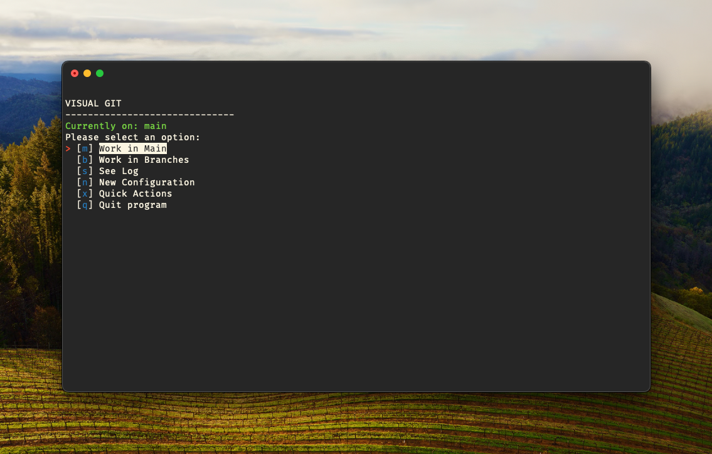

# VISUAL GIT


`Visual Git` is a command-line tool developed in Python designed to simplify and visualize common Git operations. It provides an interactive menu interface for managing local and remote Git repositories, branches, commits, and user configurations.




## Features

- **Repository Management**: Create, check, and connect local repositories with remote ones.
- **Branch Management**: Create, switch, and manage local and remote branches.
- **Commits and Pushes**: Facilitate making commits and pushing to specific branches.
- **User Configuration**: Easily configure the Git user name and email.
- **Git Installation Check**: Verify if Git is installed on the system.

## Requirements

- Python 3.x
- Git installed on the system

## Dependencies

- `simple-term-menu`: Used to make menus navigable through the keyboard arrow keys.

## Installation

Clone this repository to your local machine using:

```bash
git clone https://github.com/your-username/visual-git.git
```

Run the following command to install:

```bash
python setup.py install
```

## Usage

You can run `vigit` in your terminal to interact with your Git repositories.

```bash
vigit [arguments]
```

For more information on available commands, use:

```bash
vigit --help
```

### © Alex Arroyo 2023